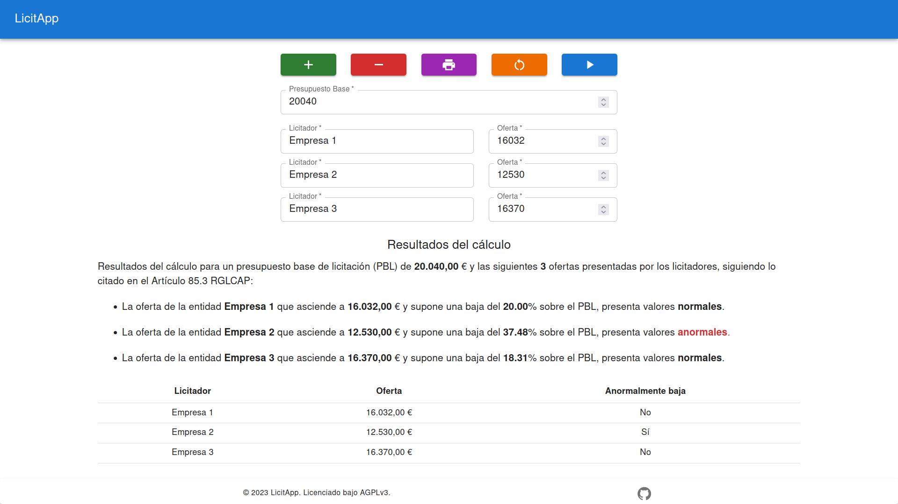

  
  
  

# 📈 LicitApp

Esta aplicación web tiene como objetivo facilitar el cálculo de licitadores cuyas
ofertas sean anormalmente bajas en los procesos de licitación pública de contratos
mayores en España.

La baja anormal es un concepto legal utilizado para determinar si una oferta
en un contrato público es significativamente inferior al valor esperado, lo cual
puede indicar que la empresa contratista no está cumpliendo con las normas
laborales y sociales requeridas por el contrato.

Para obtener más información sobre este tema, se puede consultar el
[artículo 85](https://https://boe.es/buscar/act.php?id=BOE-A-2001-19995&p=20180505&tn=1#a85)
del Real Decreto 1098/2001, de 12 de octubre, por el que se aprueba el Reglamento
general de la Ley de Contratos de las Administraciones Públicas.

## Instalación con Docker

1. Descarga el archivo `docker-compose.yml`:

~~~sh
curl -O "https://raw.githubusercontent.com/srjimmy/licitapp/main/docker-compose.yml"
~~~

2. Despliega la aplicación:

~~~sh
docker compose up -d
~~~

3. Accede a la aplicación a través del navegador:

~~~
http://localhost:8080
~~~

## Autor

- [@srjimmy](https://www.github.com/srjimmy)

## Licencia

LicitApp está sujeto a la licencia GNU Affero General Public License v3.0
